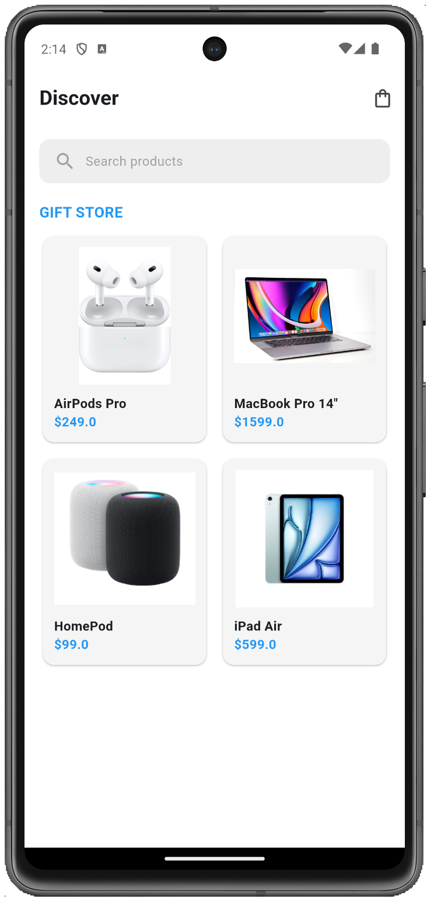
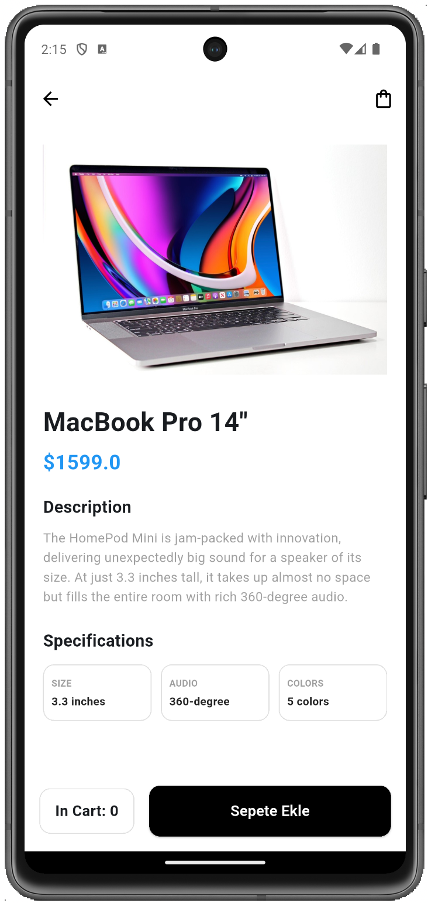
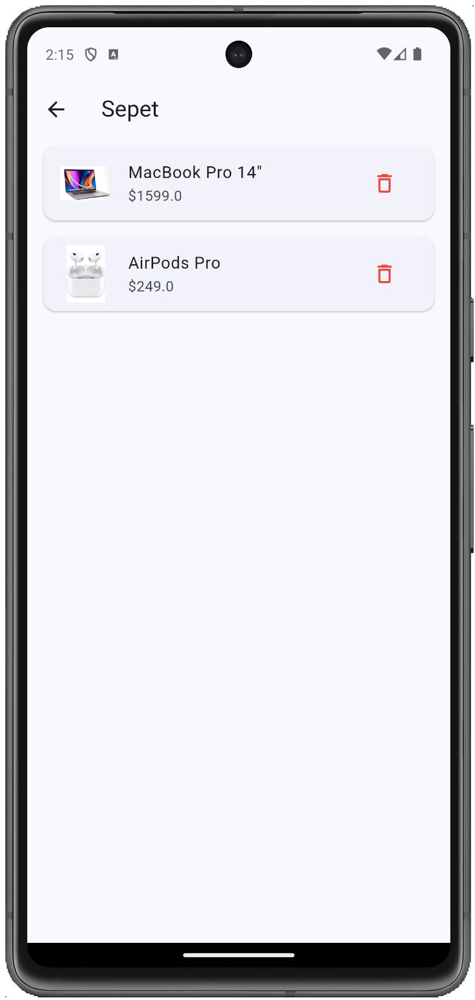
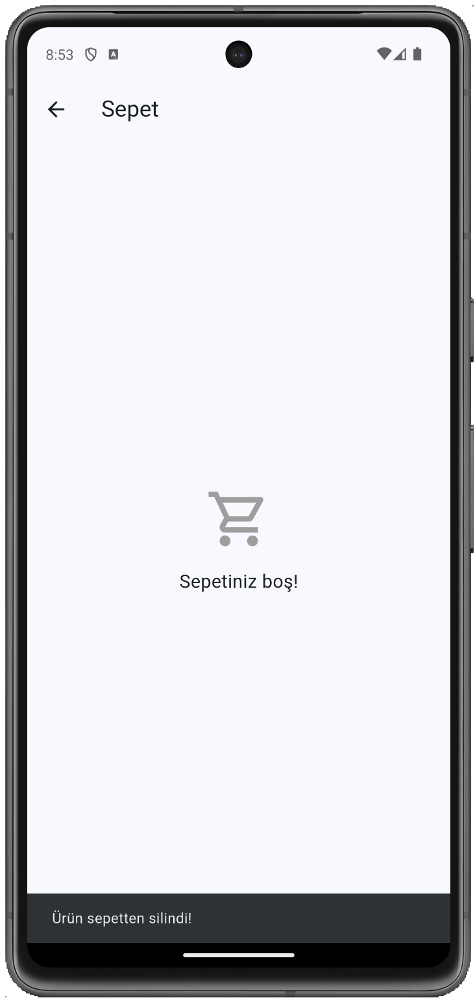

# Mini Katalog Uygulaması

## Kısa Açıklama
Flutter kullanılarak geliştirilmiş temel seviye bir mobil e-ticaret (çanta mağazası) uygulama taslağıdır. Proje kapsamında widget yapısı, Navigator ile sayfalar arası geçiş, Route Arguments ile veri taşıma, GridView ile dinamik liste oluşturma ve sepet yönetimi için basit state (durum) güncelleme işlemleri uygulanmıştır.

## Kullanılan Flutter Sürümü
Flutter 3.41.7 (Channel stable)

## Çalıştırma Adımları
Projeyi bilgisayarınızda çalıştırmak için aşağıdaki adımları izleyin:

1. Projeyi bilgisayarınıza klonlayın:
   `git clone <Sizin_GitHub_Repo_Linkiniz>`
2. Terminal üzerinden proje dizinine girin:
   `cd mini_katalog`
3. Gerekli kütüphane ve paketleri indirin:
   `flutter pub get`
4. Uygulamayı bağlı bir emülatörde veya fiziksel cihazda başlatın:
   `flutter run`

## Ekran Görüntüleri
Aşağıda uygulamanın temel arayüzlerine ait görseller bulunmaktadır:

